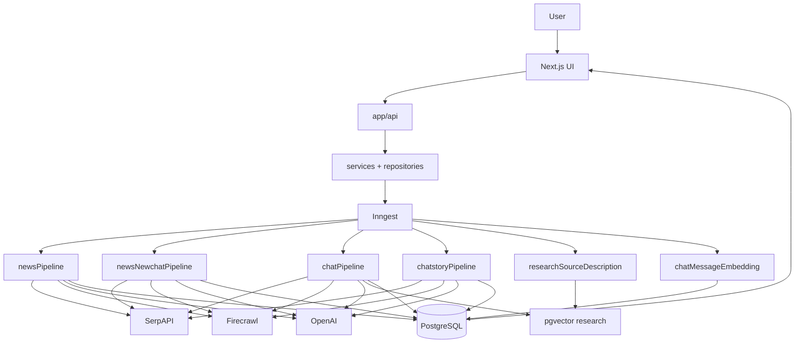
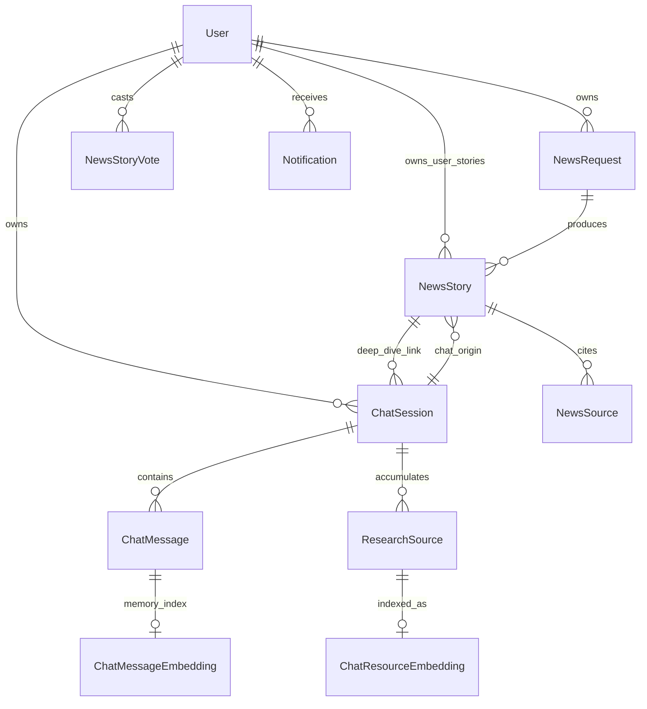

# Newsly

> A Next.js app that turns news briefing requests and chat research into evidence-backed stories and answers using SerpAPI, Firecrawl, OpenAI agents, PostgreSQL, and Inngest-backed pipelines.

This README describes the repository **as implemented today**. It is written for developers onboarding to the codebase and for architecture review—not as product marketing.

---

## What problem does it solve?

Researchers and news readers who care about **markets, policy, and local/world events** often face:

- **Fragmented information** across Google News, web results, YouTube, and one-off searches.
- **Snippets instead of sources**—search UIs rarely produce ranked stories with retrievable article text and transcripts.
- **No durable session context**—generic chat forgets what was already scraped or deduplicated in an earlier turn.
- **Manual synthesis**—turning many URLs into one structured briefing or story is repetitive and error-prone.

Normal search returns links; normal chat hallucinates or omits citations. Newsly combines **planned multi-engine discovery** (briefings), **targeted chat research** (follow-up questions), **scraped evidence persistence**, and **LLM synthesis** so outputs stay tied to stored sources.

---

## How does it solve the problem?

The product stitches several workflows that exist in code:

**Briefing (news request)**

User configures date, scope (`local` / `world` / `both`), location, categories, story count, and optional filters → `NewsRequest` is created → Inngest runs the **news pipeline** → search planning → Serp (Google News, news-tab search, YouTube) → optional AI Overview follow-up queries → article selection → Firecrawl → content cleaning → YouTube analysis branch → **NewsSynthesizer** → `NewsStory` + `NewsSource` rows → user polls progress and reads stories on `/news` and `/newsStory`.

**Contextual chat research**

User opens `/chat` or continues a session → each user message enqueues **message chat research** → guardrails → query enhancement (except deep-dive sessions) → **small determiner** chooses vector reuse, Serp tools, and/or direct Firecrawl URLs → parallel evidence gathering → cleaned scrapes saved as **`ResearchSource`** → **ChatModel** answer (or story handoff—see below).

**Deep dive on a public story**

From a story page, user starts research tied to that story → `ChatSession` with `isFromNewsStory` and selected `NewsSource` IDs → first turn uses the **deep-dive chat pipeline** (story + sources as prompt context, Serp, Firecrawl, no pgvector on that path) → follow-ups use the full message chat pipeline (vectors + cleaning).

**User-created story from chat**

On **general chat only** (not story-anchored sessions), when the determiner sets `shouldCreateStory`, the message pipeline creates a **draft** `NewsStory` (`isUserCreated: true`), passes **prepared research** (Serp hits, YouTube evidence, selected articles, existing session research) to the **chat story pipeline**, and notifies the user when synthesis completes. Owner can edit, publish, or return to chat.

**Bookmarks vs my stories**

- **`users.saved_stories`**: UUID list of **community** stories the user bookmarked (`/newsStory/bookmarks`, save API).
- **User-created stories**: rows with `isUserCreated: true` listed at `/newsStory/saved` (“My stories”).

Relationship in one line:

`User intent → durable job (Inngest) → external search/scrape → normalized evidence in DB → agent synthesis → NewsStory and/or ChatMessage + notifications`

---

## Key features

### Research

- Configurable **news requests** with loading logs and retry (`NewsRequest.status`: `pending` | `success` | `failed`).
- **Search planning** with budgets scaled by `storyCount` (`services/news/newsSearchPlanning.ts`).
- **AI Overview follow-up** searches in news and chat Serp paths.
- **YouTube** transcript branch in briefings; lighter YouTube evidence in message chat.

### News intelligence

- Multi-story **briefings** per successful request.
- **Trending** and paginated public story feeds.
- **Up/down votes** on accessible stories.
- Date and trading-recommendation filters on article candidates.

### Chat

- General research chat and **story deep-dive** sessions.
- **Guardrails**, **query enhancer**, **determiner**-driven Serp/Firecrawl/vector branches.
- **Quick actions** and **try these questions** API helpers for the UI.
- Session **rename**, **bookmark**, **delete**; auto title from first message on new user chats.
- **Stories launcher** in chat (count + list APIs per session).

### Stories

- System **`NewsStory`** rows from briefings (`isUserCreated: false`, default `publishStatus: published`).
- Chat-origin **user stories** (`isUserCreated: true`, start as **draft** with placeholder title/slug until pipeline finishes).
- Owner **PATCH**, **publish** / **unpublish** APIs; draft visible only to owner.

### Search / retrieval

- SerpAPI wrappers under `SERP/` and chat/news services.
- **pgvector** on **`ResearchSource.description`** for session-scoped similarity in message chat (top 8, min similarity 0.72).
- Async **chat message embeddings** (summarized text)—indexed in background; similarity helpers exist but are **not** wired into the live chat pipeline today.

### User features

- **Clerk** sign-in; local `User` row synced from Clerk.
- **In-app notifications** (pipeline completion/failure) with bell UI and REST API.
- Bookmark community stories; list owned chat-generated stories.

---

## Third-party libraries and services

### Runtime libraries (application)

| Name | Purpose | Where |
|------|---------|--------|
| **Next.js 16** | App Router, API routes, pages | `app/` |
| **React 19** | UI | `components/` |
| **TypeScript** | Typing across repo | — |
| **Prisma 7** | ORM, migrations | `db/schema/`, `repositories/` |
| **pg** + **@prisma/adapter-pg** | PostgreSQL driver for Prisma | `db/client.ts` |
| **Inngest** | Durable workflows | `inngest/`, `app/api/inngest` |
| **OpenAI SDK** | Chat completions + embeddings | `clients/AIClient.ts`, `Agents/` |
| **Vercel AI SDK (`ai`)** | Optional gateway path in AIClient | `clients/AIClient.ts` |
| **serpapi** | Google News / Search / YouTube | `clients/serpCleint.ts`, `SERP/` |
| **firecrawl** | URL → markdown | `clients/FireCrawlClient.ts`, `services/firecrawl/` |
| **@clerk/nextjs** | Auth middleware and components | `proxy.ts`, `app/` |
| **Zod** | Validation for APIs and agents | services, agents |
| **react-markdown** + **remark-gfm** | Render story/chat markdown | components |
| **Tailwind CSS 4**, **shadcn**, **@base-ui/react** | Styling and UI primitives | `components/ui/` |
| **GSAP** | Landing motion (reduced-motion aware) | landing components |
| **sonner** | Toasts | layout |
| **i18n-iso-countries** | Country metadata in news UI | news forms |

### External services (credentials required)

| Service | Purpose | Where |
|---------|---------|--------|
| **PostgreSQL + pgvector** | Primary data; `vector(1536)` columns | Docker `pgvector/pgvector:pg16`, port **5434** |
| **Clerk** | Authentication | env `CLERK_*`, `NEXT_PUBLIC_CLERK_*` |
| **OpenAI** | Agents, synthesizer, embeddings (`text-embedding-3-small`) | `OPENAI_API_KEY`, per-agent model env vars |
| **SerpAPI** | All programmatic search | `SERPAPI_API_KEY` |
| **Firecrawl** | Scraping after URL selection | `FIRECRAWL_API_KEY` |
| **Inngest** | Cloud/dev execution of functions | `INNGEST_*`, local `pnpm inngest:dev` |

### Development tooling

| Name | Purpose |
|------|---------|
| **pnpm 10.20.0** | Package manager (`packageManager` in `package.json`) |
| **ESLint** + **eslint-config-next** | Lint |
| **tsx** | Node tests for agents/services |
| **Prisma CLI** | `db:migrate`, `db:generate`, etc. |

---

## Technology stack

| Layer | Technology | Purpose |
|------|------------|---------|
| Frontend | Next.js 16, React 19 | Pages, API routes, RSC/client components |
| Styling | Tailwind 4, shadcn/ui | Layout and design system |
| Backend | Next.js Route Handlers | `app/api/*` |
| Database | PostgreSQL 16 (Docker) | Relational data |
| ORM | Prisma 7 | Schema, migrations, client in `db/generated/` |
| Vector search | pgvector extension | `chat_resource_embeddings`, `chat_message_embeddings` |
| AI | OpenAI (+ optional AI SDK gateway) | Agents, synthesis, embeddings |
| Search | SerpAPI | News discovery and chat research |
| Scraping | Firecrawl | Article markdown |
| Background jobs | Inngest | News, chat, story, index pipelines |
| Authentication | Clerk | User identity and middleware |
| Validation | Zod | Request bodies and event payloads |

---

## Architecture

```
Browser (Next.js UI)
      ↓
app/api/*  +  services/*  +  repositories/*
      ↓
Clerk middleware (proxy.ts) on routes
      ↓
Inngest (HTTP cannot hold 30–45m research)
      ↓
Pipelines: news | deep-dive chat | message chat | chat story | indexers
      ↓
SerpAPI · Firecrawl · OpenAI · YouTube/transcript fetchers
      ↓
PostgreSQL (+ pgvector)
      ↓
UI polling / refetch (news requests, chat sessions, notifications)
```

**Frontend** (`app/`, `components/`): landing, news briefing UI, story pages, chat layout, notification bell.

**API layer**: thin route handlers calling services; enqueue Inngest events for long work.

**Authentication**: Clerk middleware; `requireAuthenticatedUser` upserts `User` via Clerk IDs.

**Agents** (`Agents/`): LLM steps for planning, selection, cleaning, synthesis, guardrails, chat replies—invoked inside Inngest `step.run` blocks or services.

**Pipeline orchestration** (`inngest/*.ts`): retries, parallelism, idempotency keys, failure notifications.

**Research persistence**: `NewsSource` (briefing evidence), `ResearchSource` (chat evidence), optional transcripts on sources.

**Embeddings**: async indexers after inserts; message chat reads **`ChatResourceEmbedding`** for reuse.

**Synthesis**: `NewsSynthesizerAgent` for briefings and chat stories; `ChatModel` for conversational answers.

**Notifications**: `services/notifications/pipelineNotifications.ts` → `Notification` rows → `/api/notifications` + `NotificationBell`.



Registered functions: `inngest/index.ts` → served at `app/api/inngest/route.ts`.

---

## Research pipeline architecture

**Event:** `news/pipeline.requested`  
**Function:** `newsPipelineFunction` (`inngest/newsPipeline.ts`)  
**Producer:** `POST /api/news` (via `services/news/apiService.ts`)  
**Timeout:** 45 minutes  

| Stage | Role |
|-------|------|
| `load-news-request` | Load config; fail if missing |
| `plan-search-queries` | `buildNewsSearchExecutionPlans` from request fields |
| `save-search-queries` | Persist planned queries on `NewsRequest.searchQuery` |
| `fetch-and-normalize-serp` | Parallel engines; normalize links; optional AI Overview follow-ups |
| YouTube branch | Select videos → transcripts → analyze → synthesize facts for synthesizer |
| `select-articles` | `ResearchArticleSelectorAgent` on normalized hits (parallel with YouTube) |
| `scrape-selected-articles` | Firecrawl + `NewsContentCleanerAgent` per URL |
| `synthesize-stories` | `NewsSynthesizerAgent` (target `storyCount`) |
| `persist-stories-and-sources` | Create `NewsStory` (system defaults) + `NewsSource`; skip rows without primary article source |
| `mark-request-success` | `NewsRequest.status = success` |
| `create-completion-notification` | Idempotent user notification |
| `mark-request-failed` | On error: `status = failed`, failure notification |

Filters include strict request-date matching, trading-recommendation exclusion, and **YouTube as supporting evidence only** (primary article required at persist).

---

## Chat pipeline architecture

Three related workflows:

### 1. Message chat research (general + deep-dive follow-ups)

**Event:** `chat/message.research.requested`  
**Function:** `messageChatPipelineFunction` (`inngest/chatPipeline.ts`)  
**Producer:** `POST /api/chat/[chatSessionId]` (`sendChatMessage.ts`)  
**Idempotency:** `event.data.chatMessageId`; skips if assistant reply already exists  

Flow:

1. Load session/messages; optional **auto-rename** session title from first user message.
2. **Determiner** (`smallDeterminerAgent`): guardrails → query enhancer (skipped when `isFromNewsStory`) → plan vector / Serp / Firecrawl / story creation.
3. Parallel branches: **vector** (`searchSimilarChatResourceIds`), **Serp** (+ AI Overview where configured), **YouTube** evidence.
4. **Article synthesizer** (chat) + preload existing session sources.
5. Dedupe candidates → Firecrawl → **clean** → save **`ResearchSource`** (bounded concurrency).
6. If **`shouldCreateStory`** and **not** `isFromNewsStory`: create pending user story + emit **`chat/story.research.requested`** with **prepared context** (no second guardrails/enhancer pass); short assistant “writing your story” message.
7. Else: **ChatModel** → save assistant `ChatMessage` → completion notification.

### 2. Deep-dive first turn

**Event:** `chat/pipeline.requested`  
**Function:** `chatPipelineFunction` in `inngest/newsNewchatPipeline.ts`  
**Producer:** `POST /api/newsStoryChat`  

Builds research prompt from **`NewsStory` + `NewsSource`** (`newsNewChatAgent`); determiner with `isNewsStory: true`; Serp → article pick → Firecrawl → **`ResearchSource`** inserts; **no** pgvector reuse; **no** content cleaner on scrape today. Answer via **ChatModel**. Follow-ups use message chat pipeline.

### 3. Chat story pipeline (one user story)

**Event:** `chat/story.research.requested`  
**Function:** `chatStoryPipelineFunction` (`inngest/chatstoryPipeline.ts`)  
**Producer:** message chat pipeline after `createPendingChatNewsStory`  

Reuses **prepared** Serp hits, YouTube evidence, selected articles, and session research from the message pipeline. Runs **chat story research gap agent** for optional extra Serp/Firecrawl only when needed → **NewsSynthesizer** with `targetStoryCount: 1` → updates same `NewsStory` + `NewsSource` rows → completion notification. Does **not** re-run guardrails or query enhancer.

**Distinction:** Message chat optimizes for **answers** (and triggers story jobs); chat story pipeline optimizes for **one synthesized NewsStory** using evidence already paid for in the prior step.

---

## Agent architecture

Models resolve via `lib/openAiModel.ts` (env overrides per agent, else `OPENAI_MODEL`, else `gpt-4o-mini`). News synthesizer defaults include `NEWS_SYNTHESIZER_MODEL` / `gpt-5.4-mini` where configured.

| Agent | Input | Responsibility | Output | Used in |
|-------|--------|----------------|--------|---------|
| **Search planner** | News generation config | Build Serp execution plans only | Query plans | News pipeline planning |
| **GAI Overview search generator** | Serp overview payload | Extra news-tab queries | Search strings | News + chat Serp helpers |
| **Research article selector** | Normalized candidates | Pick URLs to scrape | URL list | News pipeline; via chat article synthesizer |
| **News content cleaner** | Raw markdown | Strip nav/ads; validate article | Clean text | News + message chat (not deep-dive first turn) |
| **News synthesizer** | Articles + YouTube facts | Cluster into stories | Story drafts | News pipeline; chat story pipeline |
| **YouTube video / transcript / synthesize agents** | YouTube Serp | Select videos, transcripts, facts | Structured evidence | News pipeline; chat YouTube branch |
| **Guardrails** | User prompt | Block unsafe/off-topic patterns | Allow/block | Determiner (all chat paths) |
| **Query enhancer** | Prompt + context | Sharpen research query | Enhanced prompt | Determiner (non–deep-dive flag) |
| **Small determiner** | Prompt, session flags | Choose tools, vector, story creation | Tool plan | All chat pipelines |
| **Article synthesizer (chat)** | Serp hits | Rank/limit URLs for chat | Selected articles | Chat pipelines |
| **Chat model** | Prompt + evidence + history | Markdown answer | Assistant text | Message chat, deep dive |
| **News new chat agent** | Story + sources | Long research brief | Prompt text | Deep-dive pipeline |
| **Chat story research gap agent** | Prepared evidence counts | Optional extra Serp/scrape | Gap plan | Chat story pipeline |
| **Research source description** | Research source body | Short description for embedding | Text + vector enqueue | Index pipeline |
| **Chat message summarizer vector** | Message content | Memory summary for embedding | Text | Message index pipeline |
| **Chat session title agent** | First user message | Session title | Title string | Message chat auto-rename |
| **Quick action / try these** | Session context | UI suggestion strings | JSON suggestions | Chat UI API routes |
| **Relevance agent** | — | — | — | **Not imported by pipelines** (experimental/unused) |

---

## Data / database architecture

Schema: `db/schema/schema.prisma`.

| Model | Role |
|-------|------|
| **User** | Clerk-linked identity; owns requests, chats, votes, notifications, owned stories; **`saved_stories`** UUID[] for bookmarks |
| **NewsRequest** | Briefing job config, `loadingLogs`, `status`, planned `searchQuery` |
| **NewsStory** | Synthesized story (`summary`, `content`, votes, `imageUrl`); system vs user-created; **`publishStatus`** |
| **NewsSource** | Evidence for a story (URL, scraped/cleaned content, transcript, type) |
| **ResearchSource** | Chat-session evidence (full `content`; optional `description` for vectors) |
| **ChatSession** | Thread; optional `newsStoryId` link; `isFromNewsStory`; `isBookmarked` |
| **ChatMessage** | User/agent turns |
| **ChatResourceEmbedding** | pgvector row keyed by `ResearchSource.id` |
| **ChatMessageEmbedding** | pgvector row keyed by `ChatMessage.id` |
| **NewsStoryVote** | Per-user up/down |
| **Notification** | In-app alerts with optional `dedupeKey` |
| **Script** | Schema + relations only—**no API or UI** located |

**Conversation data:** `ChatSession`, `ChatMessage`, optional message embeddings (memory—not cited as story evidence).

**Research / evidence:** `ResearchSource` (+ embeddings) for chat; `NewsSource` for published story citations.

**Published / briefing story data:** `NewsStory` + `NewsSource`, tied to `NewsRequest` and/or chat origin fields (`chatSessionId`, `ownerId`).



Public visibility: `services/news/newsStoryAccess.ts` — system stories from **successful** requests, or user stories with **`publishStatus: published`**. Draft user stories are owner-only.

---

## Vector / semantic search

| Aspect | Research sources | Chat messages |
|--------|------------------|---------------|
| **Stored in** | `chat_resource_embeddings` | `chat_message_embeddings` |
| **Vector** | `vector(1536)` | `vector(1536)` |
| **Model** | `text-embedding-3-small` via `AIClient.embedText` | Same |
| **Text embedded** | LLM **description** of each `ResearchSource` | Summarized turn text from **chatMessageSummarizerVectorAgent** |
| **When** | After `ResearchSource` insert → `research/source.index.requested` | After `ChatMessage` insert → `chat/message.index.requested` |
| **Query** | `searchSimilarChatResourceIds` scoped to session | `searchSimilarChatMessageIds` in repository |
| **Used in live chat** | **Yes**—message chat pipeline (top **8**, min similarity **0.72**) | **No**—indexer runs; similarity search **not** called from `chatPipeline.ts` today |

Embeddings support **reuse of prior chat evidence**, not replacement of fresh Serp when the determiner requests tools.

---

## Engineering & Design

### Separation of concerns

- **Search** (Serp helpers, normalization) is separate from **scraping** (Firecrawl) and **cleaning** (dedicated agent).
- **Research persistence** (`ResearchSource`, `NewsSource`) is separate from **synthesis** (synthesizer / chat model).
- **Briefing** (`newsPipeline`) and **chat** (`chatPipeline`, `newsNewchatPipeline`, `chatstoryPipeline`) share utilities but use different budgets and outputs.

### Background processing

Research exceeds HTTP timeouts (30–45m). API routes persist intent and enqueue Inngest; steps checkpoint progress and retry on failure.

### Idempotency

- Message chat: skip if assistant message already exists for user message; Inngest idempotency on `chatMessageId`.
- Chat story pipeline: idempotency on `storyId`; skip if story no longer in “generating” placeholder state.
- Notifications: `dedupeKey` + unique constraint on `(userId, dedupeKey)`.

### Deduplication

Canonical URL keys (`canonicalResearchUrl`, session dedupe before Firecrawl/insert); merge helpers for chat model context.

### Evidence handling

Stories store synthesized markdown; sources store scraped/cleaned text separately. Chat research accumulates **`ResearchSource`** rows per session for reuse and audit.

### Reuse

Shared Firecrawl helper, Serp normalization, content cleaner, synthesizer, and notification helpers across pipelines. Chat story pipeline consumes **prepared** payload from message chat to avoid repeating Serp/Firecrawl work.

### Cost control

- Determiner limits Serp tool calls and direct Firecrawl URLs (caps in agent/service code).
- Vector branch skips Serp when similarity hits suffice (`useExistingResearch`).
- Search planning clamps Serp/scrape budgets from `storyCount`.
- Chat story gap agent adds Serp/scrape **only when** gap analysis requests it.
- Bounded concurrency (e.g. **4**) on `ResearchSource` inserts.

---

## Story architecture

Single **`NewsStory`** model for both system briefings and chat-origin stories.

| | System story | User-created story |
|--|--------------|-------------------|
| **`isUserCreated`** | `false` | `true` |
| **Origin** | `newsRequestId` from briefing | `chatSessionId`, `ownerId` |
| **`publishStatus`** | Default **`published`** when persisted from briefing | Starts **`draft`**; owner publishes |
| **Public feed** | When parent `NewsRequest.status = success` | When **`published`** |
| **Generating state** | N/A | Placeholder slug/title until chat story pipeline completes; `generationError` on failure |

Owner APIs: `PATCH /api/news/stories/[storyId]`, `POST/DELETE .../publish`. UI: edit sheet, publish/move to draft, “My stories” vs community list.

System stories behave as before (votes, save/bookmark, deep dive). Published user stories behave like public stories for readers; **only the owner** edits or changes publish state.

---

## Deep dive architecture

1. User opens a **publicly accessible** story (`canViewerAccessNewsStoryPage`).
2. `POST /api/newsStoryChat` with `newsStoryId` and optional `researchRequest`.
3. Service creates **`ChatSession`** (`isFromNewsStory: true`, `newsStoryId`, selected source IDs), user message, enqueues **`chat/pipeline.requested`**.

**Context supplied:** full story fields, chosen **`NewsSource`** rows, user research text (or default research request), then Serp/scraped **`ResearchSource`** rows and chat history on follow-ups.

Deep dive is **not** limited to story owners—any viewer who can see the story may start research on it. **Draft** user stories remain owner-only and are not publicly deep-divable.

After the first turn, **`chat/message.research.requested`** applies (vectors, cleaning, determiner rules for story-anchored sessions).

---

## Setup

### Prerequisites

- **Node.js** compatible with `@types/node` **20** and Next 16 (LTS Node 20+ recommended).
- **pnpm** **10.20.0** (see `packageManager` in `package.json`).
- **Docker** (recommended) for PostgreSQL with pgvector, or another Postgres 16+ instance with `vector` extension.
- Accounts/keys: **Clerk**, **OpenAI**, **SerpAPI**, **Firecrawl**, **Inngest** (dev mode supported locally).

### Clone

```bash
git clone https://github.com/learner-enthusiast/puja-planner-.git
cd my-app
```

(Remote from `git remote -v` on this workspace; rename directory if your clone path differs.)

### Install dependencies

```bash
pnpm install
```

### Environment variables

Copy `.env.example` to `.env`. Never commit secrets.

| Variable | Required | Purpose |
|----------|----------|---------|
| `NEXT_PUBLIC_CLERK_PUBLISHABLE_KEY` | Yes | Clerk browser SDK |
| `CLERK_SECRET_KEY` | Yes | Clerk server API |
| `NEXT_PUBLIC_CLERK_SIGN_IN_URL` | Yes | Sign-in route (default `/sign-in`) |
| `NEXT_PUBLIC_CLERK_SIGN_UP_URL` | Yes | Sign-up route |
| `NEXT_PUBLIC_CLERK_SIGN_IN_FALLBACK_REDIRECT_URL` | Yes | Post sign-in redirect |
| `NEXT_PUBLIC_CLERK_SIGN_UP_FALLBACK_REDIRECT_URL` | Yes | Post sign-up redirect |
| `DATABASE_URL` | Yes | PostgreSQL connection (see Docker port **5434**) |
| `DB_URL` | No | Alternate name read by `prisma.config.ts` |
| `OPENAI_API_KEY` | Yes | LLM + embeddings |
| `OPENAI_MODEL` | No | Default model (else `gpt-4o-mini`) |
| `OPENAI_BASE_URL` | No | Custom OpenAI endpoint |
| `OPENAI_PROJECT_ID` | No | OpenAI project scoping |
| `DETERMINER_MODEL`, `GUARDRAIL_MODEL`, `CHAT_MODEL`, `QUERY_ENHANCER_MODEL`, `NEWS_SYNTHESIZER_MODEL`, `NEWS_NEW_CHAT_MODEL`, etc. | No | Per-agent overrides (see `.env.example`) |
| `AI_GATEWAY_API_KEY`, `AI_MODEL` | No | Optional Vercel AI SDK gateway |
| `FIRECRAWL_API_KEY` | Yes | Scraping |
| `SERPAPI_API_KEY` | Yes | Search |
| `SERPAPI_TIMEOUT_MS` | No | Serp client timeout if set in code |
| `INNGEST_DEV` | Dev | Set `1` for local dev server |
| `INNGEST_APP_ID` | Deploy | Inngest app id |
| `INNGEST_EVENT_KEY` | Deploy | Inngest event key |

### Database

```bash
docker compose up -d
pnpm db:migrate
pnpm db:generate
```

Postgres listens on **localhost:5434** (`docker-compose.yml`). Extension `vector` is created via `docker/postgres/init.sql`.

### Development server

Terminal 1:

```bash
pnpm dev
```

Runs `prisma generate && next dev`.

Terminal 2:

```bash
pnpm inngest:dev
```

Points Inngest dev server at `http://localhost:3000/api/inngest`.

---

## Project structure

```text
my-app/
├── app/                    # Pages and app/api route handlers
├── Agents/                 # LLM agents (news + chat)
├── clients/                # AIClient, Firecrawl, Serp, Inngest
├── components/             # UI (news/, chat/, landing/, notifications/)
├── db/
│   ├── schema/schema.prisma
│   ├── schema/migrations/
│   └── client.ts
├── docker-compose.yml      # Postgres + pgvector (port 5434)
├── hooks/                  # Client hooks (polling, etc.)
├── inngest/                # Pipeline function definitions
├── lib/                    # auth, fonts, model resolution
├── repositories/           # Prisma access layer
├── services/               # Business logic (news/, chat/, notifications/)
├── SERP/                   # Serp engine helpers
├── prisma.config.ts        # Prisma 7 config
├── proxy.ts                # Clerk middleware
└── package.json
```

Generated output: `db/generated/` (Prisma client). Omit `node_modules`, `.next` from mental model.

---

## Development workflow

| Task | Command |
|------|---------|
| Dev server | `pnpm dev` |
| Production build | `pnpm build` |
| Start production | `pnpm start` |
| Lint | `pnpm lint` |
| Typecheck | `pnpm typecheck` |
| Prisma generate | `pnpm db:generate` |
| Migrate (dev) | `pnpm db:migrate` |
| Migrate (deploy) | `pnpm db:migrate:deploy` |
| Studio | `pnpm db:studio` |
| Inngest dev | `pnpm inngest:dev` |
| Tests | `pnpm test:guardrails`, `pnpm test:query-enhancer`, `pnpm test:small-determiner`, `pnpm test:news-generation`, `pnpm test:story-votes`, YouTube tests—see `package.json` |

New schema changes: edit `db/schema/schema.prisma` → `pnpm db:migrate` → update repositories/services. New Inngest functions: export from `inngest/index.ts` and register in `inngestFunctions`.

---

## API / event architecture

### Important HTTP flows

| Flow | Method | Route | Effect |
|------|--------|-------|--------|
| Create briefing | POST | `/api/news` | `NewsRequest` + `news/pipeline.requested` |
| Poll briefing | GET | `/api/news/[newsId]` | Status, logs, stories |
| Public stories | GET | `/api/news/stories` | Paginated feed |
| Story page | GET | `/api/news/stories/[storyId]` | Detail + access rules |
| Vote | POST/DELETE | `/api/news/stories/[storyId]/vote` | Votes |
| Bookmark story | POST/DELETE | `/api/news/stories/[storyId]/save` | Updates `users.saved_stories` |
| My stories | GET | `/api/news/stories/saved` | User-created stories |
| Bookmarks list | GET | `/api/news/stories/bookmarks` | Bookmarked community stories |
| Publish draft | POST/DELETE | `/api/news/stories/[storyId]/publish` | Owner publish/unpublish |
| Edit story | PATCH | `/api/news/stories/[storyId]` | Owner metadata/content |
| Start deep dive | POST | `/api/newsStoryChat` | Session + `chat/pipeline.requested` |
| New chat | POST | `/api/chat` | General session |
| Send message | POST | `/api/chat/[chatSessionId]` | `chat/message.research.requested` |
| Session CRUD | PATCH/DELETE | `/api/chat/[chatSessionId]` | Title, bookmark, delete |
| Session stories | GET | `/api/chat/[chatSessionId]/stories` | Chat-origin stories |
| Notifications | GET/PATCH | `/api/notifications/*` | List, read, read-all |

### Inngest events

| Event | Producer | Consumer | Purpose |
|-------|----------|----------|---------|
| `news/pipeline.requested` | News API service | `newsPipelineFunction` | Full briefing |
| `chat/pipeline.requested` | `newsStoryChatService` | `chatPipelineFunction` (`newsNewchatPipeline.ts`) | Deep-dive first turn |
| `chat/message.research.requested` | `sendChatMessage` / chat service | `messageChatPipelineFunction` | Per-message research |
| `chat/story.research.requested` | Message chat pipeline | `chatStoryPipelineFunction` | Finish user story |
| `research/source.index.requested` | Research source repository enqueue | `researchSourceDescriptionFunction` | Description + vector |
| `chat/message.index.requested` | Chat message repository enqueue | `chatMessageEmbeddingFunction` | Message memory vector |

---

## Security / authorization

- **Clerk** protects API routes via middleware; handlers call `requireAuthenticatedUser` where needed.
- **NewsRequest**, **ChatSession**, and owner story mutations scoped by **`userId`** in repositories.
- **Public read**: stories matching `publicNewsStoryWhere` (successful system briefings or **published** user stories).
- **Draft user stories**: visible only when `ownerId` matches viewer.
- **Publish / PATCH story**: owner-only services.
- **Deep dive**: requires access to the story page (public published/system, or owner draft—not arbitrary private stories).

Do not commit `.env` or API keys.

---

## Limitations / trade-offs

- **External quotas**: SerpAPI, Firecrawl, and OpenAI usage dominate cost and failure modes.
- **Latency**: Briefings and story generation run minutes; UI depends on polling and notifications.
- **Deep-dive first turn**: no content cleaner and no pgvector reuse on that pipeline path.
- **Strict date filtering** on briefing articles (not a loose date window).
- **`Script` model**: no product API/UI yet.
- **`relevanceAgent`**: not connected to pipelines.
- **Chat message vectors**: indexed asynchronously; similarity retrieval not used in message chat pipeline code paths today.
- **News stories** require a **primary article source**; YouTube-only briefing rows are skipped at persist.

---

## Future work

Reasonable extension points visible from schema and code comments (not a committed roadmap):

- Product surface for **`Script`** (podcast/script export from chat research).
- Wire **chat message embedding** search into context assembly if conversational memory retrieval is desired.
- Apply **NewsContentCleanerAgent** to deep-dive Firecrawl results.
- Remove or integrate unused **`relevanceAgent`**.

---

## GitHub

Configured remote (from `git remote -v`):

- **origin:** `https://github.com/learner-enthusiast/puja-planner-.git`

Package name in `package.json` is `my-app`; product name in the UI is **Newsly**.

---

## License / project meta

`"private": true` in `package.json`. Refer to repository owners for deployment and licensing terms.
