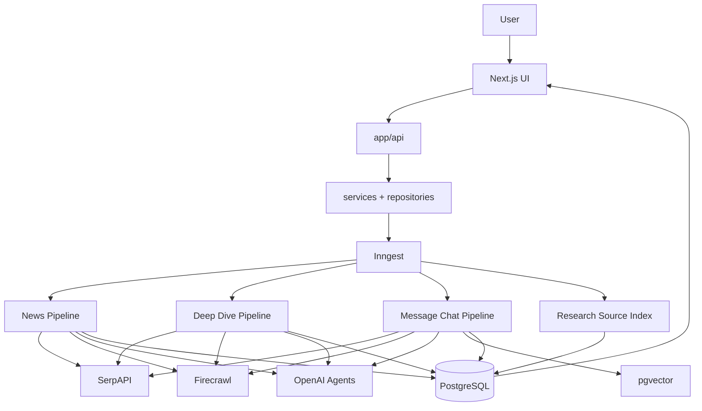
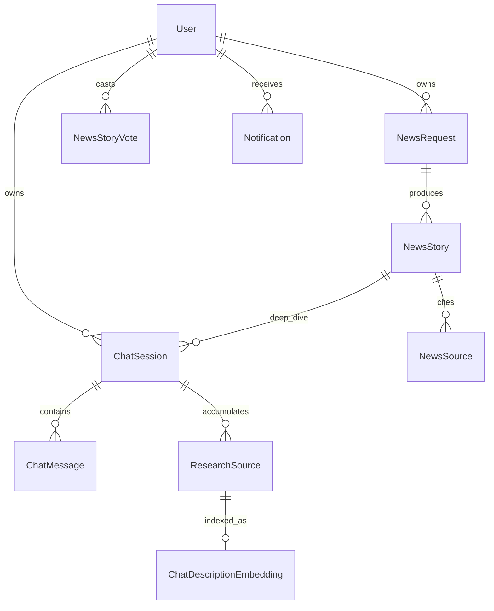
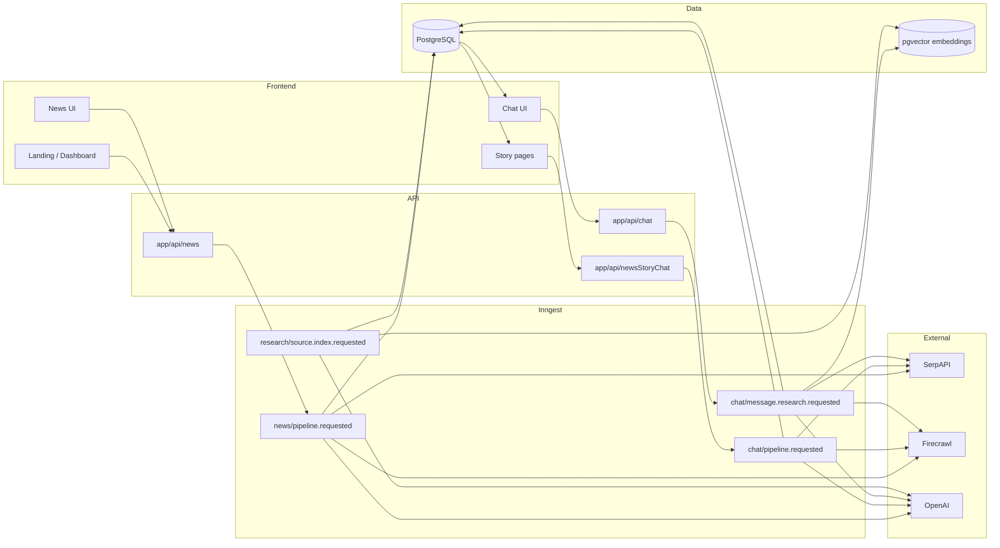

# Newsly

Newsly is a news-intelligence and research platform built as a Next.js application. It turns configurable news requests and user research questions into **evidence-backed briefings and chat answers** by orchestrating SerpAPI discovery, Firecrawl scraping, LLM-based selection and synthesis, and PostgreSQL persistence—including **pgvector** reuse for follow-up chat research.

This document describes the repository **as implemented today**. It is written for developers onboarding to the codebase, not as product marketing.

---

## What This Project Is

### Problem

Raw search results and RSS-style aggregation are insufficient for structured financial and economic research:

- Search snippets are incomplete and noisy (ads, navigation, unrelated modules).
- A single query does not produce ranked **stories** with linked **sources**.
- Follow-up questions need **session context** and **reuse of prior research**, not a full news briefing rerun.

Newsly addresses this with **two deliberately different research systems**:

| System | Orientation | Primary output |
|--------|-------------|----------------|
| **News pipeline** | Broad discovery, multi-engine Serp, YouTube branch, story clustering | `NewsStory` + `NewsSource` rows tied to a `NewsRequest` |
| **Chat research pipeline** | Targeted, latency-sensitive, context-aware | `ChatMessage` (assistant) + session-scoped `ResearchSource` rows |

A third workflow, **news-story deep dive**, reuses the chat-style research stack for the **first** research turn on a story-linked session (`chat/pipeline.requested`), without pgvector reuse on that path.

### What users can do (implemented)

- **Generate a news briefing** (`/news`): date, scope (`local` / `world` / `both`), location, categories, custom query, story count, language, optional source domains.
- **Poll briefing progress** via `NewsRequest.loadingLogs` and status (`pending` / `success` / `failed`).
- **Browse community stories** (`/newsStory`), **view a story** (`/newsStory/[storyId]`), **vote**, **save** stories (`users.saved_stories`), see **trending** on the landing page.
- **Start a deep dive** from a story → `ChatSession` linked to `NewsStory` → first answer via `chat/pipeline.requested`.
- **General chat** (`/chat`): create session, send messages → `chat/message.research.requested` with vector reuse, Serp, Firecrawl, cleaning, ChatModel.
- **Sign in** with Clerk; app user rows sync to `users`.

### Evidence → synthesis flow (conceptual)

There is **no** separate `Document` / `Claim` / `Event` entity layer in the database. Evidence and synthesis are represented practically as:

1. **Raw / normalized search hits** (in-memory during pipelines; Serp payloads normalized in `services/news/normalizeArticles.ts` and `services/chat/normalizeSerpResults.ts`).
2. **Scraped markdown** (Firecrawl).
3. **Cleaned article text** (News pipeline + message chat pipeline via `NewsContentCleanerAgent`; **not** applied in the deep-dive first-run pipeline today).
4. **Persisted evidence**: `NewsSource` (briefing), `ResearchSource` (chat), optional YouTube transcript fields on `NewsSource`.
5. **Synthesized output**: `NewsStory.content` / `summary` (briefing) or assistant `ChatMessage.content` (chat).

---

## Core Capabilities

| Capability | Status | Notes |
|------------|--------|--------|
| News briefing generation | ✅ | `news/pipeline.requested` |
| Targeted chat research | ✅ | `chat/message.research.requested` |
| News story deep dive (first turn) | ✅ | `chat/pipeline.requested` |
| Serp: Google News, Google Search (news tab), YouTube | ✅ | News + chat (chat: targeted Serp + AI Overview follow-ups) |
| AI Overview follow-up searches | ✅ | News pipeline; message chat via `fetchAndNormalizeChatSerpResearch` |
| Firecrawl scraping | ✅ | Batched `Promise.all` per URL list |
| Content cleaning | ✅ | News pipeline + message chat; **not** deep-dive pipeline |
| YouTube transcripts (supporting evidence) | ✅ | News pipeline (required primary **article** for stories); lightweight branch in message chat |
| pgvector session research reuse | ✅ | Message chat only; embeddings on `ResearchSource.description` |
| Guardrails + determiner + query enhancement | ✅ | Message chat + deep dive; news-story skips query enhancer when `isNewsStory` |
| Progress / loading logs | ✅ | `NewsRequest.loadingLogs` |
| Voting / trending | ✅ | `NewsStoryVote`, `/api/news/trending`, public story feed |
| Saved stories | ✅ | `users.saved_stories`, `/api/news/stories/saved` |
| Clerk authentication | ✅ | `proxy.ts`, `lib/auth.ts` |
| Research source indexing (async) | ✅ | `research/source.index.requested` |
| Quick actions / try-these-questions (API) | ✅ | `/api/chat/quickactions`, `/api/chat/trythesequestion` |
| Notifications UI + pipeline hooks | ❌ | `Notification` model + `repositories/notification.ts` exist; **no** API routes or pipeline writes found |
| Script generation UI | ❌ | `Script` model in schema; **no** app usage located |
| `relevanceAgent` in production path | ❌ | Agent exists under `Agents/chat/relevanceAgent.ts` but is **not** imported by pipelines |

---

## System Architecture

```
User (browser)
      ↓
Next.js App Router (app/, components/)
      ↓
Route handlers (app/api/*) + services/*
      ↓
Inngest (durable workflows)  ←── HTTP cannot hold 30–45m research
      ↓
┌─────────────────────────────────────────────────────────────┐
│ news/pipeline.requested          → newsPipelineFunction      │
│ chat/pipeline.requested          → chatPipelineFunction      │
│   (newsNewchatPipeline.ts)       (deep dive first turn)      │
│ chat/message.research.requested  → messageChatPipelineFunction│
│ research/source.index.requested  → researchSourceDescription │
└─────────────────────────────────────────────────────────────┘
      ↓
External services: SerpAPI, Firecrawl, OpenAI (via clients/AIClient.ts), YouTube/transcript fetchers
      ↓
PostgreSQL + pgvector (ChatDescriptionEmbedding)
      ↓
Frontend polls / refetches (news request polling, chat session state)
```



---

## Technology Stack

| Technology | Role in this project |
|------------|----------------------|
| **Next.js 16** | App Router, API routes, RSC/client pages (`app/`) |
| **React 19** | UI (`components/`) |
| **TypeScript** | Entire application |
| **Prisma 7** | ORM; schema in `db/schema/`; client output `db/generated/`; config `prisma.config.ts` |
| **PostgreSQL** | Primary datastore |
| **pgvector** | `chat_description_embeddings.embedding vector(1536)`; Docker image `pgvector/pgvector:pg16` |
| **Inngest** | Durable pipeline execution; served at `app/api/inngest/route.ts` |
| **SerpAPI** | Google News, Google Search, YouTube; wrapper `SERP/index.ts`, client `clients/serpCleint.ts` |
| **Firecrawl** | URL → markdown scrape; `clients/FireCrawlClient.ts`, `services/firecrawl/scrapeUrls.ts` |
| **OpenAI** | Chat/completions + embeddings via `clients/AIClient.ts` (`text-embedding-3-small`, 1536 dims) |
| **Clerk** | Auth; `@clerk/nextjs`, middleware `proxy.ts` |
| **Vercel AI SDK (`ai`)** | Used inside `AIClient` as optional gateway path |
| **Zod** | Request validation, agent I/O schemas |
| **Tailwind CSS 4 + shadcn** | UI styling |
| **GSAP** | Landing / card motion (optional, reduced-motion aware) |

---

## Repository Structure

```
my-app/
├── app/                    # Next.js routes (pages + app/api/*)
├── Agents/                 # LLM agents (news + chat); note capital A
├── clients/                # AIClient, Firecrawl, Serp, Inngest client
├── components/             # React UI (news/, chat/, landing/, ui/)
├── db/
│   ├── schema/schema.prisma
│   ├── schema/migrations/
│   ├── client.ts           # Prisma + pg adapter
│   └── generated/          # Prisma client (generated)
├── docker-compose.yml      # Postgres + pgvector on port 5434
├── hooks/                  # e.g. useNewsRequestPolling, useRecentNewsRequests
├── inngest/                # Pipeline function definitions
├── lib/                    # auth, fonts, openAiModel resolution
├── repositories/           # Thin Prisma access layer
├── services/               # Business logic (news/, chat/, firecrawl/)
├── SERP/                   # Serp engine helpers and types
├── prisma.config.ts        # Prisma 7 config (schema path, migrations)
├── proxy.ts                # Clerk middleware
└── package.json            # pnpm scripts (dev, db:*, inngest:dev, tests)
```

**Important entry points**

| Path | Responsibility |
|------|----------------|
| `inngest/newsPipeline.ts` | Briefing generation workflow |
| `inngest/chatPipeline.ts` | Follow-up message research |
| `inngest/newsNewchatPipeline.ts` | Deep-dive first chat turn (`chat/pipeline.requested`) |
| `inngest/researchSourceDescriptionPipeline.ts` | Async embedding index for `ResearchSource` |
| `inngest/index.ts` | Registers all functions for `/api/inngest` |
| `services/news/apiService.ts` | News request create, poll, public story APIs |
| `services/chat/sendChatMessage.ts` | User message + enqueue message pipeline |
| `services/news/newsSearchPlanning.ts` | Serp budgets from `storyCount` |
| `services/news/normalizeArticles.ts` | Serp normalization, date filter, trading-tip filter, AI Overview weighting |

---

## Data Model

Schema: `db/schema/schema.prisma`.

### Entity roles

| Model | Role |
|-------|------|
| **User** | Clerk-synced identity; owns requests, chats, votes, saved story IDs |
| **NewsRequest** | User briefing job: config JSON, status, loading logs |
| **NewsStory** | Synthesized story for a successful request (Markdown `content`) |
| **NewsSource** | Evidence row per story (URL, scraped/cleaned content, transcript, image) |
| **ResearchSource** | Chat-session evidence (scraped content; optional `description` for vectors) |
| **ChatSession** | Thread; optional link to `NewsStory` (`isFromNewsStory`) |
| **ChatMessage** | User/agent turns |
| **ChatDescriptionEmbedding** | pgvector row keyed by `ResearchSource.id` |
| **NewsStoryVote** | Per-user up/down on published stories |
| **Script** | Schema only (podcast/script artifact)—not wired in app code found |
| **Notification** | Schema + repository—no API/pipeline integration found |

### Key fields

- **NewsRequest**: `date`, `scope`, `location`, `categories[]`, `customQuery`, `storyCount`, `searchQuery` (planned Serp queries), `loadingLogs[]`, `status`.
- **NewsStory**: `slug`, `summary`, `content`, `category`, `newsSourceIds[]`, `imageUrl`, vote counters.
- **ChatSession**: `newsSourceId[]` (subset of story sources for deep dive), `isFromNewsStory`.

### ER diagram (simplified)



### Data flow summary

1. **Briefing**: `NewsRequest` → pipeline → many `NewsStory` + `NewsSource`.
2. **Deep dive**: `ChatSession` + first user message → `ResearchSource` rows + agent reply.
3. **Follow-up chat**: same session → more `ResearchSource` + embeddings → later turns may skip Serp via vector + determiner.

---

## News Pipeline

**Event:** `news/pipeline.requested`  
**Function:** `newsPipelineFunction` (`inngest/newsPipeline.ts`)  
**Timeout:** 45 minutes  
**Trigger payload:** `{ userId, newsRequestId, date, scope, location, categories, customQuery, storyCount, language, sources, serpHl, ... }` (merged with persisted request)

### Lifecycle

```
NewsRequest (pending)
  → plan-search-queries (buildNewsSearchExecutionPlans)
  → save-search-queries
  → fetch-and-normalize-serp (parallel engines per tier)
  → [parallel] YouTube branch  |  Article branch
  → synthesize-stories
  → persist-stories-and-sources
  → mark-request-success
```

### Stage reference

| Stage | Input | Output | Parallelism | Failure behavior |
|-------|--------|--------|-------------|------------------|
| **load-news-request** | IDs | Config + row | — | Throws if not found |
| **plan-search-queries** | `NewsGenerationConfig` | Execution plans (local/world tiers) | — | — |
| **save-search-queries** | Plans | Updates `searchQuery` JSON | — | — |
| **fetch-and-normalize-serp** | Plans | Normalized article links + YouTube Serp payload | `Promise.all` across engines/plans | Continues with partial Serp; AI Overview follow-ups optional |
| **select-youtube-videos** … **synthesize-youtube-transcript-facts** | YouTube Serp | Structured YouTube evidence for synthesizer | YouTube branch sequential steps | YouTube optional; stories still require **primary article** sources |
| **select-articles** | Normalized hits | URLs for scrape (`ResearchArticleSelectorAgent`) | Runs **parallel** with YouTube branch | — |
| **scrape-selected-articles** | URLs | Cleaned markdown per URL | Firecrawl parallel; **cleaner parallel** per page | Drops failed scrape, invalid cleaner result, trading-tip pages |
| **synthesize-stories** | Articles + YouTube evidence | Story drafts (`NewsSynthesizerAgent`) | After both branches | Model: `NEWS_SYNTHESIZER_MODEL` or `gpt-5.4-mini` |
| **persist-stories-and-sources** | Drafts | DB rows | Sequential story creates | Skips stories without primary article source |
| **mark-request-failed** | Error | `status=failed` | — | On any thrown error in try block |

### Filters and constraints (implemented)

- **Date window**: `filterArticlesNearRequestDate` — strict match to request calendar day, with previous-day evening UTC exception (`articlePublishedMatchesRequestDate`).
- **Trading recommendations**: excluded at normalize/select/scrape/synthesizer fallback (`isTradingRecommendationArticle`).
- **AI Overview follow-up**: generator agent → extra Google Search (news tab) queries; hits tagged with `selectionWeight` **1.4** (`AI_OVERVIEW_FOLLOW_UP_SELECTION_WEIGHT`).
- **YouTube**: supporting evidence only; `storyHasPrimaryArticleSource` enforced at persist.

### `storyCount` scaling (`services/news/newsSearchPlanning.ts`)

| Function | Formula (clamped) |
|----------|-------------------|
| `serpResultsPerEngine(n)` | `min(30, max(15, n * 3))` |
| `articleCandidateBudget(n)` | `min(40, max(15, n * 5))` |
| `maxArticlesToScrape(n)` | `min(20, max(n + 2, n * 2))` |

Synthesizer targets up to **`storyCount`** stories.

---

## Chat Research Pipeline

**Event:** `chat/message.research.requested`  
**Function:** `messageChatPipelineFunction` (`inngest/chatPipeline.ts`)  
**Idempotency:** `event.data.chatMessageId`  
**Timeout:** 30 minutes  

**Purpose:** Answer **one user message** in an existing session using **guardrails**, optional **query enhancement**, **pgvector reuse**, **fresh Serp** (with AI Overview follow-ups where applicable), **YouTube evidence**, Firecrawl, **content cleaning**, and **ChatModel**.

### Why it differs from the News Pipeline

| Dimension | News pipeline | Message chat pipeline |
|-----------|---------------|------------------------|
| Goal | Discover & cluster many stories | Answer one question quickly |
| Search breadth | Multi-tier, multi-engine, large budgets | Determiner-chosen Serp calls only |
| Vector reuse | No | Yes (`searchSimilarChatDescriptionIds`, limit 8, min similarity **0.72**) |
| Query enhancer | N/A | Yes (skipped when `isNewsStory` on deep-dive sessions for follow-ups—see determiner) |
| Article pick | `ResearchArticleSelectorAgent` + news prompts | `ArticleSynthesizerAgent` (`topPercent: 40`, `maxArticles: 6`) |
| Output | `NewsStory` | `ChatMessage` + `ResearchSource` |
| Cleaning | Yes | Yes (`runNewsContentCleanerAgent` after Firecrawl) |

### Flow

```
check-existing-assistant-reply (idempotent skip)
  → fetch-chat-context ∥ count-research-embeddings
  → run-determiner (guardrails → enhancer → Serp/firecrawl URL plan)
  → [parallel] vector-research-branch | serp-research-branch | youtube-research-branch
  → run-article-synthesizer ∥ preload-session-research-sources
  → dedupe-research-candidates
  → firecrawl-and-save-research (clean + bounded concurrent inserts, concurrency 4)
  → generate-assistant-reply (ChatModel)
  → save-assistant-message
```

### Determiner outputs (`smallDeterminerAgent`)

- `useExistingResearch` + `existingResearchQuery` (semantic query against embeddings)
- `useTools` + validated Serp tool calls
- `firecrawlUrls` (direct URLs, capped—see `MAX_DETERMINER_FIRECRAWL_URLS`)
- Guardrail block → short agent refusal message step

---

## News Story Deep Dive

**Event:** `chat/pipeline.requested`  
**Function:** `chatPipelineFunction` in `inngest/newsNewchatPipeline.ts` (exported name collides with generic “chat pipeline”—this is the **deep-dive** handler)

**Payload:** `{ userId, chatSessionId, userMessageId }`

### Starting a deep dive

1. Client calls `POST /api/newsStoryChat` with `{ newsStoryId, researchRequest? }`.
2. Service creates `ChatSession` (`isFromNewsStory: true`, `newsStoryId`, selected `newsSourceId[]`), user message, enqueues `chat/pipeline.requested`.

### Research prompt

- **`build-research-prompt`**: loads `NewsStory` + `NewsSource` rows; `runNewsNewChatAgent` builds a long research brief (default `DEFAULT_NEWS_RESEARCH_REQUEST` if user text empty).

### Evidence collection

- **Determiner** runs with `isNewsStory: true` (skips query enhancer path inside agent).
- Serp → `ArticleSynthesizerAgent` (40% / 6 max) → batch Firecrawl → **`ResearchSource` inserts** (concurrency 4).
- **Does not** run pgvector reuse on this pipeline.
- **Does not** run `NewsContentCleanerAgent` on scraped markdown today (raw/truncated Firecrawl text stored, fallback to title).

### Answer

- `runChatModelAgent` with research prompt, Serp hits, scraped sources, recent chat history (optimized single history fetch).
- Persists agent `ChatMessage`.

Follow-up turns on the same session use **`chat/message.research.requested`** (full chat pipeline with vectors + cleaning).

---

## AI / Agent Architecture

Models resolve via `lib/openAiModel.ts`: override → agent env var → `OPENAI_MODEL` → `gpt-4o-mini`.

| Agent | File | Called from | Must NOT |
|-------|------|-------------|----------|
| **Search planner** | `Agents/news/searchPlanner.ts` | News search planning | Execute Serp (planning only) |
| **Research article selector** | `Agents/news/ResearchArticleSelectorAgent.ts` | News pipeline, `ArticleSynthesizerAgent` | Write final stories/answers |
| **News content cleaner** | `Agents/news/NewsContentCleanerAgent.ts` | News + message chat pipelines | Summarize, invent facts, merge articles |
| **News synthesizer** | `Agents/news/NewsSythesizeragent.ts` | News pipeline | Replace need for article sources with YouTube-only stories |
| **GAI Overview search generator** | `Agents/news/GAIOverviewSearchGeneratorAgents.ts` | News pipeline (and chat Serp helper) | — |
| **YouTube video selector** | `Agents/news/YoutubeVideoAgent.ts` | `services/news/youtubeResearch.ts` | — |
| **YouTube transcript analyzer** | `Agents/news/YoutubeTranscriptAgent.ts` | YouTube branch | — |
| **YouTube transcript synthesize** | `Agents/news/YoutubeTranscriptSyntesizeAgent.ts` | YouTube branch | — |
| **Stock guardrails** | `Agents/chat/guardrails.ts` | Determiner | Answer research questions |
| **Query enhancer** | `Agents/chat/queryEnhancerAgent.ts` | Determiner (non–news-story flag) | — |
| **Small determiner** | `Agents/chat/smallDeterminerAgent.ts` | All chat pipelines | — |
| **Article synthesizer (chat)** | `Agents/chat/ArticleSythesizerAgent.ts` | Chat pipelines | — |
| **Chat model** | `Agents/chat/chatModel.ts` | Chat + deep dive | — |
| **News new chat agent** | `Agents/chat/newsNewChatAgent.ts` | Deep-dive prompt build | — |
| **Research source description** | `Agents/chat/researchSourceDescriptionAgent.ts` | Index pipeline | — |
| **Quick action / try these** | `Agents/chat/UIChatAgents/*` | UI suggestion API routes | Browse web |
| **Relevance agent** | `Agents/chat/relevanceAgent.ts` | *(unused in pipelines)* | — |

---

## Search Architecture

Implementation hub: `SERP/index.ts` + `services/news/normalizeArticles.ts` + chat helpers in `services/chat/chatSerpResearch.ts` / `chatSerpWithAiOverview.ts`.

| Mechanism | Use |
|-----------|-----|
| **Google News** | Briefing discovery per tier |
| **Google Search (`tbm: nws`)** | Web news tab results |
| **YouTube search** | Candidate videos; transcripts in news pipeline |
| **AI Overview** | Detected in Serp payload → follow-up query generation → extra searches |
| **Location** | Serp `location` / `gl` / `hl` from request config |
| **Categories** | Keyword expansion (`NEWS_CATEGORY_KEYWORDS`), combined into queries—not one API call per category |
| **Deduplication** | Canonical URL keys (`canonicalResearchUrl`, session dedupe helpers) |
| **Direct URLs** | Determiner `firecrawlUrls` merged via `mergeDirectFirecrawlTargets` |

Multiple mechanisms exist because **news discovery** needs breadth, while **chat** needs targeted evidence and optional overview expansion without rerunning an entire briefing plan.

---

## Vector Search

| Item | Value |
|------|--------|
| **Stored in** | `chat_description_embeddings` |
| **Vector** | `vector(1536)` |
| **Embedding model** | `text-embedding-3-small` (via `AIClient.embedText`) |
| **Text embedded** | LLM-generated **description** of each `ResearchSource` (not full raw HTML) |
| **When** | Async after `createResearchSource` → `research/source.index.requested` |
| **Query** | `searchSimilarChatDescriptionIds` with session scope |
| **Limits** | Top **8**, min similarity **0.72** (message chat pipeline constants) |
| **Combined with fresh Serp** | Determiner sets `useExistingResearch`; branches run in parallel; ChatModel merges vector rows + new scrapes |

---

## Firecrawl

- **When**: After URL selection (news scrape step; chat `firecrawl-and-save-research`; deep dive `scrape-and-persist-sources`).
- **Batching**: `scrapeUrlsWithFirecrawl` → `Promise.all` over URLs; failed URL → `null`, caller falls back (e.g. title-only).
- **News pipeline**: raw markdown passed to **cleaner** before synthesizer.
- **Chat pipeline**: clean before `ResearchSource` insert; triggers embedding enqueue.
- **Dedupe**: Session URL keys before insert; fresh re-fetch before scrape on chat path to avoid races.

---

## Content Cleaning

`NewsContentCleanerAgent`: strips ads, nav, promos, related-articles modules, etc.; outputs `{ cleanedContent, isValidArticle }`.

**Must NOT** (enforced in prompt/schema intent): invent facts, rewrite to match requested date/location, merge multiple articles, replace synthesis step.

Invalid articles are dropped from news scrape results; chat pipeline skips or falls back per step logic.

---

## YouTube Research

**News pipeline (heavy):** Serp YouTube → select videos → fetch transcripts → analyze → synthesize facts → fed into `NewsSynthesizerAgent` as supporting rows; transcripts also stored on `NewsSource.transcript` when linked.

**Message chat (lightweight):** `fetchChatYoutubeEvidence` in parallel with Serp/vector branches; stored as research context for ChatModel—not full briefing clustering.

---

## Inngest Architecture

| Function ID | Event | Input | Idempotency / notes |
|-------------|-------|-------|---------------------|
| `news-pipeline` | `news/pipeline.requested` | `userId`, `newsRequestId`, generation fields | Failure → `mark-request-failed` + rethrow (Inngest retry) |
| `chat-pipeline` | `chat/pipeline.requested` | `userId`, `chatSessionId`, `userMessageId` | Deep dive first turn |
| `message-chat-research-pipeline` | `chat/message.research.requested` | `chatSessionId`, `chatMessageId` | **Idempotent** on `chatMessageId`; skips if assistant reply exists |
| `research-source-description-index` | `research/source.index.requested` | `researchSourceId`, `chatSessionId` | Fire-and-forget from repository |

**Why Inngest:** Research runs exceed HTTP timeouts (30–45m), require retries, parallel steps, and durable checkpoints— impractical inside a single API request.

**Local dev:** `pnpm inngest:dev` (points at `http://localhost:3000/api/inngest`).

---

## Performance / Concurrency

- News: parallel Serp engines; **YouTube ∥ article** branches after normalize; parallel Firecrawl; parallel cleaner calls.
- Message chat: vector ∥ Serp ∥ YouTube; synthesizer ∥ preload sources; bounded **4** concurrent `ResearchSource` inserts.
- Deep dive: parallel session/message load; synthesizer ∥ preload existing sources; same insert concurrency pattern.
- Chat pipelines record **`durationMs`** on major steps (deep-dive file).

---

## Persistence / Database Flow

| When | What writes |
|------|-------------|
| `POST /api/news` | `NewsRequest` + Inngest event |
| News pipeline success | `NewsStory`, `NewsSource`, request `success` |
| News pipeline failure | request `failed`, error string |
| Chat user send | `ChatMessage` (user) + Inngest event |
| Chat pipeline success | `ResearchSource`(s), `ChatMessage` (agent) |
| `createResearchSource` | Row insert + enqueue index event |
| Index pipeline | `ResearchSource.description`, `ChatDescriptionEmbedding` |
| Vote API | `NewsStoryVote` + counter updates (via service) |
| Save story API | `users.saved_stories` array update |

**Notifications:** repository supports CRUD; **no pipeline hook** found.

---

## Notifications

**Not implemented end-to-end.** The `Notification` model and `repositories/notification.ts` exist, but there are no `app/api` routes referencing them and no `createNotification` calls from Inngest handlers in this repo. Do not expect in-app notifications until wired.

---

## Authentication and Authorization

- **Clerk** middleware on app + API routes (`proxy.ts`).
- **`getAuthenticatedUser` / `requireAuthenticatedUser`** upsert Clerk user to `users` via `upsertUserFromClerk`.
- Resources scoped by `userId` in repositories (`getNewsRequestByIdForUser`, `getChatSessionByIdForUser`, etc.).
- Public read: published stories (`newsRequest.status = success`) for `/newsStory` feed and story pages; votes/saves require auth.

---

## API / Application Flow

| Method | Route | Auth | Purpose |
|--------|-------|------|---------|
| POST | `/api/news` | Yes | Create briefing → `news/pipeline.requested` |
| GET | `/api/news` | Yes | Recent requests |
| GET/POST | `/api/news/[newsId]` | Yes | Poll/retry request |
| GET | `/api/news/stories` | Optional viewer | Paginated public stories |
| GET | `/api/news/stories/[storyId]` | Optional | Story page payload |
| GET/POST/DELETE | `/api/news/stories/[storyId]/vote` | Yes | Vote |
| GET/POST/DELETE | `/api/news/stories/[storyId]/save` | Yes | Saved stories list |
| GET | `/api/news/stories/saved` | Yes | Paginated saved feed |
| GET | `/api/news/trending` | Public | Landing trending |
| POST | `/api/newsStoryChat` | Yes | Start deep dive → `chat/pipeline.requested` |
| GET | `/api/newsStoryChat` | Yes | List chat sessions |
| POST | `/api/chat` | Yes | New general chat session |
| POST | `/api/chat/[chatSessionId]` | Yes | Send message → `chat/message.research.requested` |
| GET | `/api/chat/quickactions/[chatSessionId]` | Yes | Quick action suggestions |
| GET | `/api/chat/trythesequestion/[chatSessionId]` | Yes | Suggested questions |
| GET | `/api/me` | Yes | Current user |
| * | `/api/inngest` | Inngest | Workflow serve |

---

## Frontend

| Route | Experience |
|-------|------------|
| `/` | Landing (signed out) or dashboard (signed in) |
| `/news` | Create briefing (categories, country autocomplete, story count) |
| `/news/[newsId]` | Poll progress, story cards, deep dive, save/vote |
| `/newsStory` | Community story list |
| `/newsStory/saved` | Saved stories (auth) |
| `/newsStory/[storyId]` | Story detail + deep dive entry |
| `/chat`, `/chat/[chatSessionId]` | Research chat UI |
| `/sign-in`, `/sign-up` | Clerk |

Polling: `useNewsRequestPolling` drives briefing UI from `/api/news/[newsId]`. Chat waits on pipeline-completed messages in session.

---

## Environment Variables

See `.env.example`. Names only:

| Variable | Purpose |
|----------|---------|
| `NEXT_PUBLIC_CLERK_*`, `CLERK_SECRET_KEY` | Clerk auth URLs and secret |
| `DATABASE_URL` / `DB_URL` | PostgreSQL connection |
| `OPENAI_API_KEY`, `OPENAI_MODEL`, `OPENAI_BASE_URL`, `OPENAI_PROJECT_ID` | OpenAI client |
| `DETERMINER_MODEL`, `GUARDRAIL_MODEL`, `CHAT_MODEL`, `QUERY_ENHANCER_MODEL`, `NEWS_SYNTHESIZER_MODEL`, `NEWS_NEW_CHAT_MODEL`, `NEWS_CONTENT_CLEANER_MODEL`, `RESEARCH_ARTICLE_SELECTOR_MODEL`, … | Per-agent overrides |
| `FIRECRAWL_API_KEY` | Firecrawl |
| `SERPAPI_API_KEY`, `SERPAPI_TIMEOUT_MS` | SerpAPI |
| `INNGEST_DEV`, `INNGEST_APP_ID`, `INNGEST_EVENT_KEY` | Inngest |
| `AI_GATEWAY_API_KEY`, `AI_MODEL` | Optional AI SDK gateway |

Never commit secrets.

---

## Running Locally

1. **Clone** the repository.
2. **Install:** `pnpm install` (packageManager: pnpm@10.20.0).
3. **Env:** copy `.env.example` → `.env` and fill required keys.
4. **Database:** `docker compose up -d` (Postgres **5434**, pgvector enabled via `docker/postgres/init.sql`).
5. **Migrate:** `pnpm db:migrate` (schema in `db/schema/migrations/`).
6. **Generate client:** `pnpm db:generate` (also runs on `postinstall` / `pnpm dev`).
7. **App:** `pnpm dev` (runs `prisma generate && next dev`).
8. **Inngest:** in another terminal, `pnpm inngest:dev`.

Optional tests: `pnpm test:news-generation`, `pnpm test:guardrails`, etc. (see `package.json`).

---

## Development Workflow

1. **New agent:** add under `Agents/`, Zod schemas, use `createAIClient` / `aiClient`, wire from a pipeline `step.run` or service.
2. **New pipeline step:** add `step.run("name", ...)` in the relevant `inngest/*.ts` file; keep side effects inside steps.
3. **New Inngest function:** define in `inngest/`, export from `inngest/index.ts`, register in `inngestFunctions`.
4. **Schema change:** edit `db/schema/schema.prisma`, `pnpm db:migrate`, fix repositories/services.
5. **New API route:** `app/api/.../route.ts`, call services, enqueue Inngest with `inngest.send`.
6. **Test pipeline:** run app + Inngest dev, trigger via UI or send event through Inngest CLI/dev server.

---

## Error Handling and Reliability

- Inngest **retries** on thrown errors; message chat **skips duplicate work** if assistant message already exists.
- Serp/Firecrawl partial failure: continue with available evidence; null scrapes fall back to titles.
- Cleaner marks `isValidArticle: false` → row dropped (news) or skipped (chat).
- Guardrail block → user-visible refusal message, no Serp burn.
- News request failure: persisted `failed` status + error string; UI retry via `POST /api/news/[newsId]`.
- Chat failure: `save-error-message` step writes agent failure text when implemented in pipeline catch paths.

---

## Design Principles (visible in code)

- **Evidence before synthesis** — scrape and clean (where enabled) before LLM story/answer.
- **Separate briefing vs chat** — different budgets, agents, and persistence models.
- **Parallelize independent I/O** — Serp, vector, YouTube, preload queries.
- **Bounded concurrency** — DB inserts capped (e.g. 4) to protect the pool.
- **Persist reusable research** — `ResearchSource` + embeddings for follow-ups.
- **Session URL dedupe** — avoid duplicate Firecrawl/DB work.
- **Primary article requirement** — news stories cannot be YouTube-only.
- **Graceful degradation** — optional branches (YouTube, overview, failed URLs) do not always abort the run.

---

## Limitations

- **Deep-dive pipeline** does not run content cleaner or pgvector on the first turn.
- **`Notification`**, **`Script`**: schema/repository only; no product UI/API integration found.
- **`relevanceAgent`**: not connected to live pipelines.
- **Notifications** and some UI suggestion endpoints may return errors if sessions/messages are empty—handled at API layer.
- News date filtering is **strict** (not a ±3 day window).
- Research pipelines depend on external API quotas (Serp, Firecrawl, OpenAI).

---

## Future Extension Points

- Wire `Notification` creation on `NewsRequest` success / chat completion.
- Use `Script` model for podcast/script export from chat research.
- Apply `NewsContentCleanerAgent` to deep-dive Firecrawl results.
- Connect or remove unused `relevanceAgent`.
- Shadow DB migrations in CI using the same ordered migration history as local.

---

## Final Architecture Diagram



---

## License / project meta

Private application (`"private": true` in `package.json`). Refer to repository owners for deployment and licensing terms.
